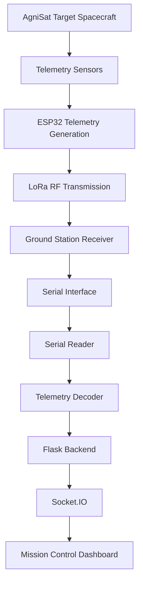

# 🛰️ HACKSAT

### Satellite Ground Station & Aerospace Cybersecurity Research Platform

Real-Time Satellite Telemetry • LoRa Communication • Antenna Tracking • ADCS Monitoring • Aerospace Cybersecurity Research • Embedded Systems Research

---

## Overview

**HACKSAT** is an advanced satellite, ground station, and aerospace cybersecurity research platform designed for real-time telemetry acquisition, RF communication, embedded systems experimentation, and industrial communication research.

### Technical Specifications

| Parameter            | Value                            |
| -------------------- | -------------------------------- |
| Microcontroller      | ESP32                            |
| RF Communication     | 433 MHz LoRa                     |
| IMU                  | MPU6050                          |
| Environmental Sensor | DHT11                            |
| GPS Module           | NEO-6M                           |
| Telemetry Interval   | 2 seconds                        |
| Error Detection      | CRC16                            |
| Backend              | Python Flask                     |
| Dashboard            | Flask + SocketIO                 |
| Application Domain   | Aerospace Cybersecurity Research |

### Key Components

| Component | Description |
|-----------|-------------|
| 📡 Telemetry Acquisition | Embedded sensor data acquisition (DHT11, MPU6050) using ESP32 |
| 📻 LoRa Communication | 433 MHz RF transmission |
| 🏗️ Ground Station | Serial interface and Flask backend |
| 🎯 Antenna Tracking | Real-time tracking visualization |
| 🛰️ ADCS Monitoring | Attitude determination and control system |
| 🔒 Cybersecurity | Modbus-based attack simulation |

### Telemetry Data Types

| Category | Data Points |
|----------|-------------|
| **Housekeeping** | Temperature, Humidity, Mission Uptime, Communication Status |
| **ADCS** | Accelerometer (X,Y,Z), Gyroscope (X,Y,Z), Roll, Pitch, Relative Yaw, ADCS Mode |
| **Payload** | Radiation measurements, Payload status, Scientific data |

---

## Project Scope

HACKSAT is intended for:

- Aerospace cybersecurity research
- Satellite communication experimentation
- Ground station development
- Telemetry and telecommand testing
- Educational demonstrations
- Industrial communication security research

HACKSAT is not intended to represent a flight-qualified spacecraft or operational mission system.

---

## Project Architecture



**Data Flow:**
1. **Satellite Node** - AgniSat Target Spacecraft collects telemetry from sensors
2. **Transmission** - LoRa module sends data to ground station
3. **Reception** - LoRa Serial interface receives and decodes packets
4. **Processing** - Flask backend processes and enhances telemetry
5. **Visualization** - Web dashboard displays real-time data

---

## About AgniSat

AgniSat is the target spacecraft monitored by the HACKSAT Ground Station.

**Onboard Telemetry:**
- Temperature & Humidity (DHT11)
- Attitude Data (MPU6050 IMU: Roll, Pitch and Relative Yaw Estimation)
- Radiation Payload
- GPS Navigation
- Communication Status

---

## Features

### Ground Station Dashboard

| Feature | Description |
|---------|-------------|
| **Command & Data** | APID, Sequence Count, Mission Uptime |
| **Housekeeping** | Temperature, Humidity monitoring |
| **ADCS Monitoring** | Current/Target Roll/Pitch/Relative Yaw, ADCS Mode |
| **Navigation** | Altitude, Speed, Orbit data |
| **Antenna Tracking** | Azimuth, Elevation, Tracking Status |
| **Payload Monitoring** | Radiation data, Payload status |
| **Communication** | Link status, Signal strength, Data rate |

### ADCS Modes

| Mode | Description |
|------|-------------|
| **SAFE** | Safe mode with minimal attitude control |
| **DETUMBLE** | Reduces spacecraft rotation rates |
| **NOMINAL** | Normal operations with full attitude control |
| **PAYLOAD OPS** | Optimized for scientific data collection |

### Attitude Estimation

The HACKSAT platform uses an MPU6050 6-axis IMU for attitude estimation.

- Roll is calculated from accelerometer data.
- Pitch is calculated from accelerometer data.
- Relative Yaw is estimated by integrating the gyroscope Z-axis angular velocity using real elapsed time (dt).
- Startup gyroscope bias calibration is used to reduce relative yaw drift.

**Note:** The MPU6050 does not include a magnetometer. Therefore, relative yaw is a relative estimate and not an absolute heading. Long-term drift is expected. This implementation is intended for aerospace research, cybersecurity experimentation, and educational demonstrations rather than navigation-grade spacecraft attitude determination.

### Communication State Machine

The system follows a simple connection process to establish and maintain communication with the satellite:

**Connection States:**
- **LOST** - No connection to satellite
- **ACQUIRING** - Connecting and searching for signal
- **TRACKING** - Signal found, tracking satellite
- **LOCKED** - Stable connection established

**How it works:**
1. Start in LOST state (no connection)
2. When you connect, system tries to ACQUIRE signal
3. Once signal is found, it TRACKS the satellite
4. When connection is stable, it becomes LOCKED
5. If connection is lost, it returns to LOST and tries to reconnect

### Cybersecurity Features

**Modbus Attack Simulation:**

| Attack Type | Description | Recovery |
|-------------|-------------|----------|
| **Disconnect** | Writing coil0 = 0 blocks connection | coil0 = 1 or CONNECT button |

**Capabilities:**
- Realistic attack simulation
- Automatic reconnection blocked during attack
- Explicit recovery control required
- Research-grade cybersecurity testing

---

## Telecommand System

The ground station supports realistic operational telecommands following real spacecraft operations.

**Architecture Principle:** Telemetry is the master source. Telecommands represent operator intent and set targets, but do not permanently override live telemetry values.

### Mission Information

| Field | Value |
|-------|-------|
| Mission | HACKSAT |
| Spacecraft | AgniSat |

### Available Commands

| Command Type | Description |
|--------------|-------------|
| **ADCS Mode** | SAFE, DETUMBLE, NOMINAL, PAYLOAD OPS |
| **Target Attitude** | Roll, Pitch, Relative Yaw (operator intent) |
| **Antenna Mode** | AUTO or MANUAL tracking |
| **Antenna Position** | Azimuth, Elevation (MANUAL mode) |
| **Link Control** | CONNECT, DISCONNECT, RECOVER LINK |

### Command Behavior

- **Telecommand Override**: Current values reflect commanded targets for 5 seconds, then revert to live telemetry
- **Persistent Modes**: ADCS modes remain active until explicitly changed
- **Command Log**: Real-time mission log with last 20 entries

---

## Installation

### Cross-Platform Support

| Platform | Status |
|----------|--------|
| **Linux** | ✅ Linuxmint, Ubuntu, Debian, Fedora |
| **Windows** | ✅ Windows 10, Windows 11 |
| **macOS** | ✅ macOS 10.15+ |

### Quick Start

```bash
# Clone repository
git clone <repository-url>
cd satellite_project_final/project

# Create virtual environment
python3 -m venv venv
source venv/bin/activate  # On Windows: venv\Scripts\activate

# Install dependencies
pip install -r requirements.txt

# Run the application
python3 app_cross_platform.py  # On Windows: python app_cross_platform.py
```

### Platform-Specific Notes

**Linux:**
```bash
sudo usermod -a -G dialout $USER  # Serial port permission
sudo venv/bin/python3 app_cross_platform.py  # Requires sudo for port 502 (privileged port)
```

**Note:** Port 502 is a privileged port (below 1024), so the project requires sudo to run on Linux. On Windows, no elevation is required for port 502.

**Windows:**
- Serial ports named `COMx` (e.g., COM3, COM4)
- May need to allow Python through Windows Firewall

**macOS:**
- Grant serial port permission in System Preferences > Security & Privacy

---

## Running the Application

### Start the Server

| Platform | Command |
|----------|---------|
| Linux/macOS | `source venv/bin/activate && sudo python3 app_cross_platform.py` |
| Windows | `venv\Scripts\activate && python app_cross_platform.py` |

### Access the Dashboard

```
http://localhost:5000
```

Or from another device on the same network:

```
http://<YOUR-IP>:5000
```

---

## Technologies Used

### Backend

| Technology | Purpose |
|------------|---------|
| Python 3 | Core language |
| Flask | Web framework |
| Flask-SocketIO | Real-time communication |
| PySerial | Serial interface |
| Multithreading | Concurrent processing |

### Frontend

| Technology | Purpose |
|------------|---------|
| HTML5 | Structure |
| CSS3 | Styling |
| JavaScript | Interactivity |
| Socket.IO | Real-time updates |

### Hardware

| Component | Purpose |
|-----------|---------|
| ESP32 | Satellite microcontroller |
| LoRa Module | RF communication |
| DHT11 | Temperature/Humidity sensor |
| MPU6050 | IMU (accelerometer/gyroscope) |
| Radiation Payload | Scientific payload |

---

## Project Structure

```
project/
├── firmware/
│   └── final_satellite_code_copy.ino
├── modules/
│   ├── antenna.py
│   ├── serial_reader.py
│   ├── telemetry.py
│   └── modbus_control.py
├── static/
│   ├── css/
│   ├── js/
│   └── images/
├── templates/
│   └── index.html
├── app_cross_platform.py
├── requirements.txt
└── README.md
```

---

## Contributing

**Contributors:**
- [Arun Mane](https://github.com/arunm2110)
- [Girija Deshmukh](https://github.com/Girija207)

We welcome contributions from the community. Please feel free to submit pull requests, report issues, or suggest new features, enhancements, and tools.

---

## Contact & Support

For questions, support, or collaboration opportunities:

- **Website:** [Dellon Technology](https://dellon.io)
- **GitHub Issues:** [Submit an Issue](https://github.com/Dellon-Technology-Pvt-Ltd/HackSat/issues)

---

## Version Information

**Current Version:** HackSat v1.0

Future updates will be released progressively with new features and research scenarios.

---


